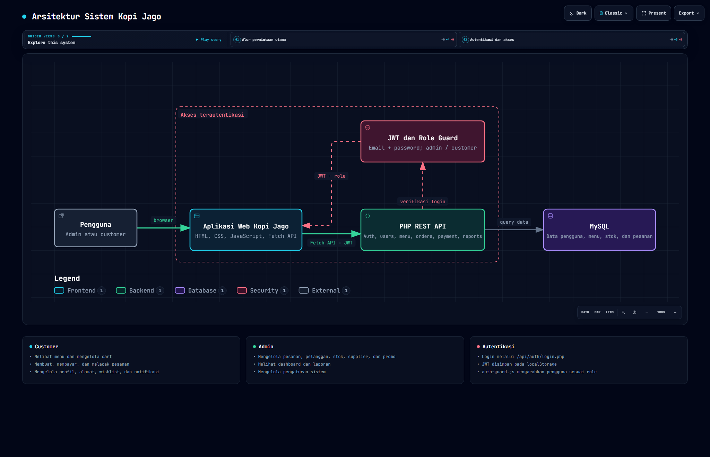

```text
frontend/
│   └── src/
│       ├── index.html                     # Landing page
│       │
│       ├── auth/
│       │   ├── login.html
│       │   └── register.html
│       │
│       ├── customer/
│       │   ├── home.html
│       │   ├── menu.html
│       │   ├── cart.html
│       │   ├── orders.html
│       │   │
│       │   ├── settings/                  # Halaman Pengaturan Pengguna
│       │   │   ├── profile.html           # Edit profil (nama, email, no. HP, foto)
│       │   │   ├── wishlist.html          # Daftar menu favorit/disimpan
│       │   │   ├── change-password.html   # Ganti password
│       │   │   └── notifications.html     # Preferensi notifikasi
│       │   │
│       │   ├── shipping/                  # Halaman Pengaturan Pengiriman
│       │   │   ├── index.html             # Halaman induk/tab pengaturan pengiriman
│       │   │   ├── order-history.html     # Riwayat/histori pesanan
│       │   │   ├── address.html           # Kelola alamat pengiriman
│       │   │   ├── method.html            # Pilihan metode pengiriman
│       │   │   └── cost.html              # Tampilan biaya pengiriman
│       │   │
│       │   └── payment/                   # Halaman Pembayaran
│       │       ├── methods.html           # Daftar & pilih metode pembayaran digital
│       │       └── info.html              # Detail/konfirmasi info pembayaran
│       │
│       ├── admin/
│       │   ├── dashboard.html
│       │   ├── pesanan.html
│       │   ├── pelanggan.html
│       │   ├── stok.html
│       │   ├── supplier.html
│       │   ├── promo.html
│       │   ├── laporan.html
│       │   └── pengaturan.html
│       │
│       ├── css/
│       │   ├── style.css                  # Style untuk customer
│       │   └── admin.css                  # Style khusus admin
│       │
│       ├── js/
│       │   ├── api.js                     # Wrapper fetch + auto-attach JWT token
│       │   ├── auth.js                    # Login, register, simpan/hapus token
│       │   ├── auth-guard.js              # Cek token & role sebelum render halaman
│       │   ├── cart.js
│       │   ├── wishlist.js
│       │   ├── shipping.js
│       │   ├── payment.js
│       │   └── admin/
│       │       ├── dashboard.js           # Chart & statistik admin
│       │       └── table.js               # Filter/sort tabel 
│       │
│       ├── components/                    # HTML yang di-inject via JS (navbar, sidebar, footer)
│       │   ├── navbar-customer.html
│       │   ├── sidebar-admin.html
│       │   └── footer.html
│       │
│       └── assets/
│           └── images/
│
└── backend/
    └── api/
        ├── auth/
        │   ├── login.php
        │   ├── register.php
        │   └── logout.php
        │
        ├── users/
        │   ├── profile.php                # GET/PUT profil
        │   └── change-password.php
        │
        ├── wishlist/
        │   └── index.php                  # GET/POST/DELETE wishlist
        │
        ├── notifications/
        │   └── preferences.php            # GET/PUT preferensi notifikasi
        │
        ├── orders/
        │   ├── index.php                  # POST buat pesanan
        │   └── history.php                # GET riwayat pesanan
        │
        ├── shipping/
        │   ├── address.php                # CRUD alamat pengiriman
        │   ├── method.php                 # GET metode pengiriman
        │   └── cost.php                   # GET kalkulasi biaya pengiriman
        │
        ├── payment/
        │   ├── methods.php                # GET daftar metode pembayaran digital
        │   ├── checkout.php               # POST proses pembayaran
        │   └── status.php                 # GET status/info pembayaran
        │
        ├── menu/
        │   └── index.php                  # GET menu (customer) / CRUD (admin)
        │
        ├── inventory/
        │   ├── stok.php
        │   └── supplier.php
        │
        ├── promo/
        │   └── index.php
        │
        ├── reports/
        │   └── index.php                  # Laporan penjualan (admin)
        │
        ├── core/                          # Class & fungsi inti 
        │   ├── Database.php               # Koneksi  ke database
        │   ├── Auth.php                   # Hash password, generate/verify JWT
        │   ├── Middleware.php             # Cek token & role dari header Authorization
        │   └── Response.php               # Helper  JSON
        │
        └── config/
            └── config.php                 # Konfigurasi Database, secret key JWT, dll
```
